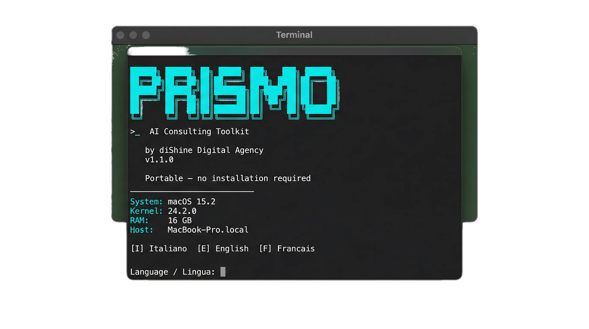
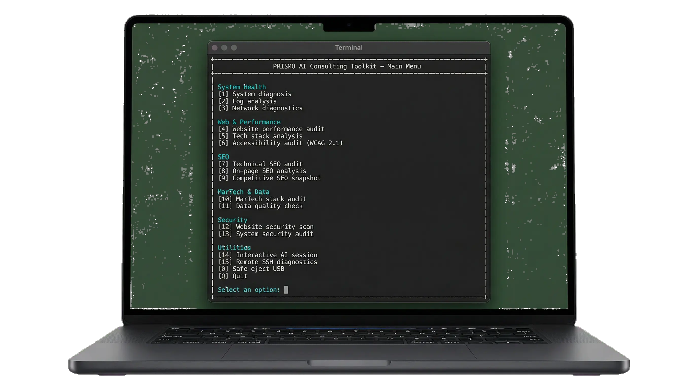
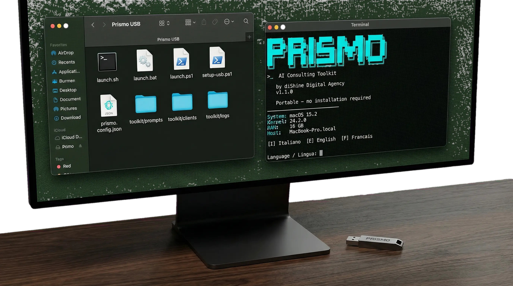
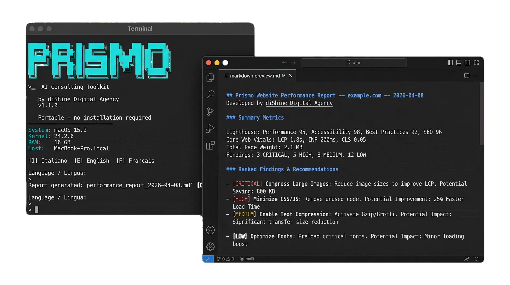

# 🌟 Prismo, a zero-footrpint AI consulting toolkit for on-site tech & marketing audits

<div align="center">


***Transform. Automate. Shine!***

[](https://dishine.it/blog/prismo-ai-consulting-toolkit-usb/)
[](https://linkedin.com/company/100682596)
[]()
[](LICENSE)

<p align="center">
  
</p>

*Prismo bundles a portable Node.js runtime with [Claude Code](https://docs.anthropic.com/en/docs/claude-code) and a library of diagnostic prompts on a USB drive. It runs 15 audits across system health, web performance, SEO, MarTech, and security, without installing anything on the client's machine.*

Built by [diShine Digital Agency](https://dishine.it). Read more on the [diShine blog](https://dishine.it/blog/prismo-ai-consulting-toolkit-usb/).

</div>

<p align="center">
  
  
</p>

<p align="center">
  
</p>

---

## How It Works

1. **Prepare**: Run `setup-usb.ps1` once on a Windows machine to download Node.js, the AI engine, and audit tools onto a USB drive.
2. **Launch**: Plug the USB into any Windows, macOS, or Linux machine and run the launcher script.
3. **Audit**: Select from 15 diagnostic options. The AI engine collects data, analyzes it, and generates a structured Markdown report.
4. **Leave**: Remove the USB. Nothing is installed or left behind on the host.

### Internet Requirement

Prismo is zero-footprint but **not air-gapped**. It requires an active internet connection to query the Anthropic AI API. No software is installed on the client's hard drive, the host machine acts only as a network gateway.

---

## Features

### System Health
| # | Audit | Description |
|---|-------|-------------|
| 1 | System diagnosis | CPU, RAM, disk, services, logs, pending updates |
| 2 | Log analysis | Parse any log file for errors, warnings, and patterns |
| 3 | Network diagnostics | Interfaces, DNS, routing, ports, firewall, connectivity |

### Web and Performance
| # | Audit | Description |
|---|-------|-------------|
| 4 | Website performance | Core Web Vitals (LCP, INP, CLS), Lighthouse metrics |
| 5 | Tech stack analysis | Frameworks, CMS, hosting, CDN, third-party scripts |
| 6 | Accessibility | WCAG 2.1 AA compliance checks |

### SEO
| # | Audit | Description |
|---|-------|-------------|
| 7 | Technical SEO | robots.txt, sitemaps, canonicals, schema, hreflang, redirects |
| 8 | On-page SEO | Titles, metas, headings, content quality, internal links |
| 9 | Competitive snapshot | Side-by-side SEO comparison against competitors |

### MarTech and Data
| # | Audit | Description |
|---|-------|-------------|
| 10 | MarTech stack | GTM, GA4, pixels, CRM, consent management |
| 11 | Data quality | Event tracking, UTM consistency, data layer validation |

### Security
| # | Audit | Description |
|---|-------|-------------|
| 12 | Website security | SSL/TLS, security headers, CMS vulnerabilities, cookie flags |
| 13 | System security | Users, permissions, firewall, SSH, encryption, patching |

### Utilities
| # | Audit | Description |
|---|-------|-------------|
| 14 | Interactive AI session | Direct access to the AI engine for custom queries |
| 15 | Remote SSH diagnostics | Connect and diagnose remote servers |
| 0 | Safe USB eject | Gracefully unmount across all platforms |

---

## Quick Start

### 1. Prepare the USB (one-time, requires internet)

On a Windows machine with PowerShell:

```powershell
# Insert USB drive (e.g., drive E:)
.\setup-usb.ps1 -UsbDrive E
```

This downloads Node.js, the AI engine, Lighthouse, and pa11y onto the drive (~900 MB).

### 2. Launch on any machine

**Windows:**
```
Double-click launch.bat
```

**macOS / Linux:**
```bash
bash /Volumes/USB/launch.sh
# or
bash /media/user/USB/launch.sh
```

### 3. Run an audit

Select an option from the menu. For web, SEO, and MarTech audits, provide the target URL when prompted. Reports are saved to `toolkit/reports/`.

---

## First-Time Setup

Prismo relies on portable binaries that are too large for GitHub. Before your first audit:

1. **Format a USB drive** to exFAT (cross-platform) or NTFS (Windows-only).
2. **Clone or copy this repository** to the root of the USB drive.
3. **Download Node.js portable binaries** for Windows, macOS, and Linux. Extract them into `runtime/node-win-x64/`, `runtime/node-darwin-arm64/`, etc.
4. **Install the AI engine:**
   ```bash
   npm install -g @anthropic-ai/claude-code --prefix /path/to/usb/engine
   ```
5. **Generate the integrity file** (optional, for tamper detection):
   ```bash
   find . -type f -not -name "SHA256SUMS" -exec sha256sum {} + > SHA256SUMS
   ```

Or use the automated script: `.\setup-usb.ps1 -UsbDrive E`

---

## USB Drive Structure

```
USB_ROOT/
├── launch.sh              # Linux/macOS launcher
├── launch.bat             # Windows CMD launcher
├── launch.ps1             # Windows PowerShell launcher
├── setup-usb.ps1          # One-time USB preparation script
├── prismo.config.json     # Configuration
├── prismo-eject.ps1       # Safe USB eject (Windows)
├── VERSION                # Current version number
├── runtime/               # Portable Node.js + Git (downloaded by setup)
├── engine/                # AI engine + Lighthouse + pa11y
├── config/                # Credentials (stay on the USB)
└── toolkit/
    ├── prompts/           # AI diagnostic prompts
    │   ├── system/        # Windows, Linux, macOS health checks
    │   ├── web/           # Performance, tech stack, accessibility
    │   ├── seo/           # Technical, on-page, competitive
    │   ├── martech/       # Stack audit, data quality
    │   └── security/      # Website and system security
    ├── scripts/           # Data collection scripts
    ├── reports/           # Generated audit reports (Markdown)
    ├── clients/           # Client profile JSON files
    └── logs/              # Session logs
```

---

## Configuration

Edit `prismo.config.json` to set defaults:

```json
{
  "language": "auto",
  "client": {
    "name": "Acme Corp",
    "domain": "acme.com",
    "industry": "E-commerce",
    "notes": "Migration to headless planned for Q3"
  },
  "preferences": {
    "auto_save_reports": true
  }
}
```

### Client Profiles

Store per-client context in `toolkit/clients/` so the AI has background on who you are auditing. Repeat visits build on previous findings instead of starting from scratch.

```json
{
  "name": "Acme Corp",
  "domain": "acme.com",
  "stack": "WordPress + WooCommerce",
  "analytics": "GA4 + GTM",
  "previous_audits": ["2026-01-15", "2026-03-20"],
  "notes": "Migration to headless planned for Q3"
}
```

---

## Platform Support

| Platform | System Diagnosis | Web Audit | Guided Repair |
|----------|-----------------|-----------|---------------|
| Windows 10/11 | Yes | Yes | Yes |
| Windows Server 2016+ | Yes | Yes | Yes |
| macOS (Intel + Apple Silicon) | Yes | Yes | Yes |
| Linux (x64) | Yes | Yes | Yes |

---

## Authentication

Prismo requires an active Claude subscription (Pro, Max, or an API key from [console.anthropic.com](https://console.anthropic.com)).

- **Browser login**: handled automatically during `setup-usb.ps1`.
- **API key**: set in `config/.claude/settings.json`.
- **If you lose the USB**: revoke your session immediately at [console.anthropic.com](https://console.anthropic.com).

---

## Security

Prismo is a consulting convenience tool, not an enterprise security product. Key considerations:

- It is **not designed for regulated environments** (GDPR processing, HIPAA, PCI-DSS, ISO 27001 scoping).
- Diagnostic data transits through Anthropic's API, do not use it on systems with classified or sensitive personal data.
- Credentials sit on the USB drive in plaintext. Encrypt the drive (BitLocker, VeraCrypt, FileVault).
- The AI engine can execute real commands. Always review and confirm before approving anything destructive.
- SHA256 checksums verify script integrity at launch for tamper detection.

See [SECURITY.md](SECURITY.md) for the full security policy and vulnerability reporting.

---

## Requirements

- **USB drive**: 2 GB minimum (4 GB recommended), exFAT or NTFS
- **Setup machine**: Windows with PowerShell 5.1+, internet connection
- **Target machine**: Windows 10+, macOS 10.15+, or Linux (x64)
- **Claude account**: Pro, Max, or API key ([anthropic.com](https://anthropic.com))

---

## Documentation

- **[GUIDE.md](GUIDE.md)**: Complete user guide with step-by-step instructions for all features
- **[CHANGELOG.md](CHANGELOG.md)**: Version history
- **[CONTRIBUTING.md](CONTRIBUTING.md)**: How to contribute
- **[SECURITY.md](SECURITY.md)**: Security policy and vulnerability reporting
- **[LICENSE](LICENSE)**: MIT License

---

## Acknowledgments

Prismo builds on the foundation of [Wolfix](https://github.com/ipalumbo73/wolfix) by **Ivan Palumbo**. The portable AI infrastructure (Node.js extraction, cross-platform launchers, USB eject handling) originates from his work.

---

## License

MIT License: see [LICENSE](LICENSE) for details.

Copyright (c) 2026 [diShine Digital Agency](https://dishine.it)

---

## About diShine

[diShine](https://dishine.it) is a creative tech agency based in Milan. We build tools for digital consultants, help businesses with AI strategy and MarTech architecture, and open-source the things we wish existed.

- Web: [dishine.it](https://dishine.it)
- GitHub: [github.com/diShine-digital-agency](https://github.com/diShine-digital-agency)
- Contact: kevin@dishine.it
